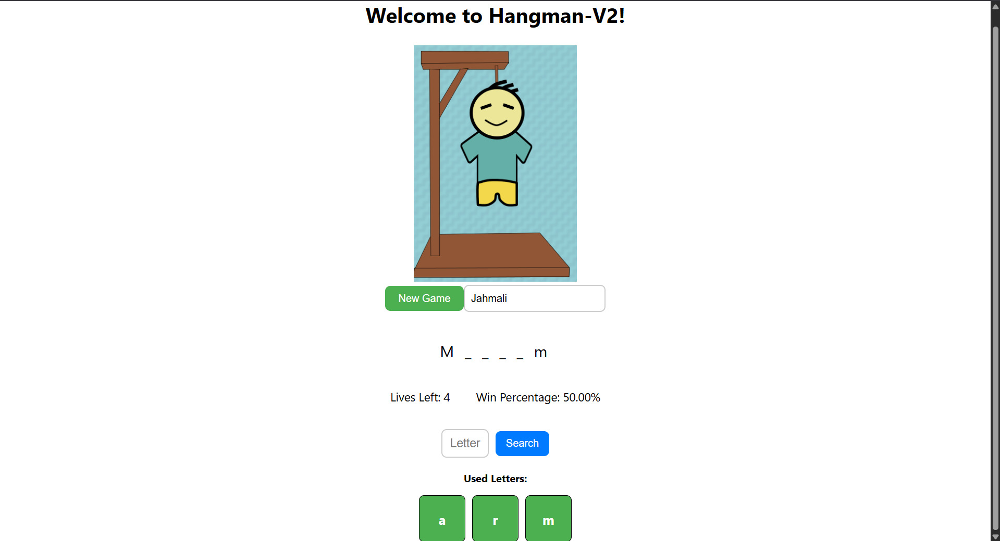

# Hangman-V2



## Description  
A more intermediate Hangman game built with React, MongoDB, using class-based components.

## New Features
Introduces player name, win percentage, and UI changes.
Along with new tech usage such as: Mongodb by using Docker, Unit Testing with Jest, and Backend/Server using Node.js

## How to Play
1. Guess letters one at a time to reveal the hidden word.
2. You have 6 lives. Each incorrect guess reduces your lives by 1.
3. Win by guessing all the letters in the word before running out of lives.

### Running the app

1. Clone the repository of the project in the terminal using:
````
git clone https://github.com/JahmaliB/Hangman-V2.git
cd Hangman-V2
````
2. Open Docker Desktop (have it running in the background)

3. Enable MongoDB using Docker
````
docker-compose up -d
````

4. Change into the Server Directory Folder then start the server
````
cd BackendServer
node server
````
5. Go into a new terminal and Change to the current project directory
````
cd Hangman-V2
````

6. Install the frontend dependencies needed to run the program using:
````
npm install
````

7. Start the server using:
````
npm start
````

8. (Optional) Your program should open automatically but if it does not copy and paste this into your browser:
'http://localhost:3000'
